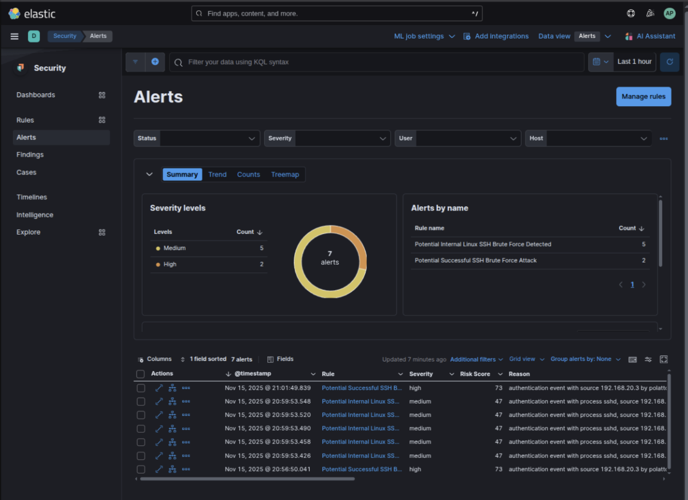

# Monitoramento de Segurança de Hosts com Elastic SIEM para Conformidade com PCI-DSS

Este documento fornece um guia passo a passo para configurar o monitoramento de segurança de hosts usando o **Elastic SIEM** com **Auditbeat** e **Filebeat** para atender aos requisitos do **PCI-DSS** (Padrão de Segurança de Dados da Indústria de Cartões de Pagamento). Ele inclui a instalação e configuração dos Beats, a criação de políticas personalizadas de Gerenciamento do Ciclo de Vida do Índice (ILM), a implementação do Controle de Acesso Baseado em Funções (RBAC) e a validação de regras de detecção. Este guia foi desenvolvido para usuários iniciantes no Elastic SIEM, servindo como um manual de instruções para fins educacionais e de conformidade.

# O que é o Elastic SIEM?

O **Elastic SIEM** (Security Information and Event Management) é um módulo do Elastic Stack (Elasticsearch, Kibana, Beats, Logstash) projetado para coletar, analisar e visualizar eventos de segurança para detecção de ameaças e resposta a incidentes. Ele utiliza os poderosos recursos de busca e análise do Elasticsearch para monitorar hosts, redes e aplicativos, gerando alertas para atividades suspeitas, como ataques de força bruta, malware ou acesso não autorizado.

Os principais recursos incluem:
- **Ingestão de Dados**: Coleta logs e eventos via Elastic Beats (agentes leves como Auditbeat e Filebeat).

- **Regras de Detecção**: Regras pré-configuradas e personalizadas (por exemplo, EQL, KQL) para identificar ameaças.

- **Dashboards**: Visualizações no Kibana para logs, alertas e linhas do tempo.

- **Compliance**: Suporta PCI-DSS, GDPR e outros padrões, garantindo trilhas de auditoria, retenção de logs e controles de acesso.

O Elastic SIEM é ideal para conformidade com PCI-DSS, pois fornece registro centralizado, monitoramento em tempo real e acesso baseado em funções para atender a requisitos como trilhas de auditoria (Req. 10.2), segurança de logs (Req. 10.5) e acesso restrito (Req. 7).

# Monitoramento de Hosts com Elastic Beats

O Elastic Beats é um serviço leve de coleta de dados que envia eventos de segurança para o Elasticsearch. Para monitoramento de hosts, utilizamos:
- **Auditbeat**: Captura eventos do auditd (por exemplo, acesso a arquivos, execução de processos) e alterações de integridade de arquivos diretamente do kernel do Linux.
- **Filebeat**: Coleta logs do sistema (por exemplo, `/var/log/auth.log`, `/var/log/syslog`) e, opcionalmente, logs do auditd para análise adicional.

## Fleet Server vs. Beats Autônomo
O Elastic oferece duas abordagens para gerenciar o Beats:

1. **Fleet Server**:

     - Uma solução de gerenciamento centralizada dentro do Elastic Stack para implantar e configurar agentes Beats.
     - Prós:
          - Simplifica o escalonamento e a atualização de múltiplos agentes.
          - Fornece uma interface de usuário no Kibana para gerenciamento de políticas.
          - Suporta inscrição de agentes e configuração remota.
     - Contras:
          - Requer configuração adicional (implantação do Fleet Server (Já instaldo em deployment do Elastic Cloud)).
          - Aumenta a sobrecarga para configurações pequenas.
          - Menos flexível para configurações personalizadas.
          - Ainda não foi possível configurar o Fleet para ingressar Hosts dinâmicos na cloud.
               Isso é necessário para ambientes com escalonamento automático, como as VMSS da Azure.
     - Caso de uso: Ambientes grandes com muitos hosts que necessitam de controle centralizado.

2. **Beats independentes**:

     - Os Beats são instalados e configurados manualmente em cada host.
     - Prós:
          - Controle total sobre os arquivos de configuração (por exemplo, `auditbeat.yml`, `filebeat.yml`).
          - Sem dependência do Fleet Server, reduzindo a complexidade.
          - Ideal para fluxos de dados personalizados, políticas ILM e configurações de pequena escala.
     - Contras:
          - Atualizações e configurações manuais para cada host.
          - Sem interface de usuário centralizada para gerenciamento.
     - Caso de uso: Hosts individuais ou ambientes que necessitam de personalização detalhada.

**Abordagem deste guia**: Utilizamos **Beats independentes** (Auditbeat e Filebeat) para obter o máximo controle sobre fluxos de dados personalizados (`.ds-auditbeat-pci-*`, `.ds-filebeat-pci-*`), políticas ILM (`pci-logs-12month`) e RBAC, em conformidade com os requisitos do PCI-DSS e com sua preferência por configurações independentes.

## Conformidade com PCI-DSS com o Elastic SIEM

O Elastic SIEM oferece suporte a diversos requisitos do PCI-DSS essenciais para a segurança dos dados de cartões de pagamento:
- **Requisito 7 (Restringir Acesso)**: O RBAC garante que apenas usuários autorizados acessem os logs, implementado por meio de funções do Elasticsearch e privilégios do Kibana.

- **Requisito 10.2 (Trilhas de Auditoria)**: O Auditbeat e o Filebeat capturam as ações do usuário (por exemplo, logins SSH, acesso a arquivos, execução de processos) com registros de data e hora e resultados.

- **Requisito 10.5.? (Trilhas de Auditoria Seguras)**: Políticas ILM personalizadas (`pci-logs-12month`) impõem retenção de 12 meses e imutabilidade (via `freeze` na fase fria).

- **Requisito 10.4.? (Revisão Diária de Logs)**: As regras de detecção do SIEM (por exemplo, alertas de força bruta) permitem o monitoramento e o alerta automatizados para eventos de segurança.

- **Requisito 11.5.? (Monitoramento de Integridade de Arquivos)**: O módulo `file_integrity` do Auditbeat monitora diretórios críticos (`/etc`, `/bin`) em busca de alterações não autorizadas.

Essa configuração garante a conformidade por meio do registro, proteção e análise de eventos de segurança, com acesso restrito e retenção a longo prazo.

## Política ILM personalizada (pci-logs-12month)

As políticas de Gerenciamento do Ciclo de Vida do Índice (ILM) gerenciam o ciclo de vida dos índices do Elasticsearch, garantindo a conformidade com os requisitos de retenção. Criamos uma política ILM personalizada, `pci-logs-12month`, para atender ao Requisito 10.5 do PCI-DSS (retenção de logs por 12 meses).

**Policy Definition** (`pci-logs-12month.json`):
```json
{
  "policy": {
    "phases": {
      "hot": {
        "min_age": "0ms",
        "actions": {
          "rollover": {
            "max_age": "30d",
            "max_primary_shard_size": "50gb"
          },
          "set_priority": { "priority": 100 }
        }
      },
      "warm": {
        "min_age": "3d",
        "actions": {
          "allocate": { "require": { "data": "warm" } },
          "forcemerge": { "max_num_segments": 1 },
          "set_priority": { "priority": 50 }
        }
      },
      "cold": {
        "min_age": "90d",
        "actions": {
          "allocate": { "require": { "data": "cold" } },
          "set_priority": { "priority": 0 },
          "freeze": {}
        }
      },
      "delete": {
        "min_age": "365d",
        "actions": { "delete": {} }
      }
    }
  }
}
```

**Principais Funcionalidades**:
- **Hot Phase**: Rotaciona os índices após 30 dias ou 50 GB, priorizando o desempenho.
- **Warm Phase**: Após 3 dias, otimiza o armazenamento com `forcemerge`.
- **Cold Phase**: Após 90 dias, congela os índices para imutabilidade (PCI-DSS Req. 10.5).
- **Delete Phase**: Exclui os índices após 365 dias, atendendo ao requisito de retenção de 12 meses.

Essa política é aplicada aos fluxos de dados do Auditbeat e do Filebeat por meio da config `setup.ilm.policy_file`, ou, pre-definida no ElasticSearch.

## RBAC para Conformidade com PCI-DSS

O Controle de Acesso Baseado em Funções (RBAC) restringe o acesso a dados de segurança, atendendo ao Requisito 7 do PCI-DSS. Definimos funções para os fluxos de dados do Auditbeat e do Filebeat (`.ds-auditbeat-pci-*`, `.ds-filebeat-pci-*`).

### Auditbeat RBAC
1. **Viewer Role** (`pci_audit_viewer`):
   ```bash
   POST _security/role/pci_audit_viewer
   {
     "indices": {
       "auditbeat-pci-polatto": {
         "privileges": ["read", "view_index_metadata"],
         "query": "{\"match\": {\"event.dataset\": \"auditbeat\"}}"
       }
     },
     "applications": [
       {
         "application": "kibana-.kibana",
         "privileges": ["feature_discover.read", "feature_dashboard.read", "feature_logs.read"],
         "resources": ["*"]
       }
     ]
   }
   ```
     - Concede acesso somente leitura aos dados do Auditbeat e aos recursos do Kibana (Discover, Dashboards, Logs).

2. **Admin Role** (`pci_audit_admin`):
   ```bash
   POST _security/role/pci_audit_admin
   {
     "cluster": ["manage_ilm"],
     "indices": {
       "auditbeat-pci-polatto": {
         "privileges": ["read", "view_index_metadata", "delete_index", "manage"],
         "query": "{\"match\": {\"event.dataset\": \"auditbeat\"}}"
       }
     },
     "applications": [
       {
         "application": "kibana-.kibana",
         "privileges": ["feature_index_management.all", "feature_ilm.all", "feature_discover.read"],
         "resources": ["*"]
       }
     ]
   }
   ```
   - Adiciona privilégios de gerenciamento de ILM e exclusão de índices.

3. **User Assignment**:
   ```bash
   POST _security/user/pci_audit_user
   {
     "password": "secure_password",
     "roles": ["pci_audit_viewer"],
     "full_name": "PCI Audit User"
   }
   ```

### Filebeat RBAC
1. **Viewer Role** (`pci_filebeat_viewer`):
   ```bash
   POST _security/role/pci_filebeat_viewer
   {
     "indices": {
       "filebeat-pci-polatto": {
         "privileges": ["read", "view_index_metadata"],
         "query": "{\"bool\":{\"should\":[{\"match\":{\"event.dataset\":\"filebeat\"}},{\"match\":{\"event.dataset\":\"auditbeat\"}}]}}"
       }
     },
     "applications": [
       {
         "application": "kibana-.kibana",
         "privileges": ["feature_discover.read", "feature_dashboard.read", "feature_logs.read"],
         "resources": ["*"]
       }
     ]
   }
   ```
     - Abrange eventos analisados ​​tanto pelo Filebeat quanto pelo auditd.

2. **Admin Role** (`pci_filebeat_admin`):
   ```bash
   POST _security/role/pci_filebeat_admin
   {
     "cluster": ["manage_ilm"],
     "indices": {
       "filebeat-pci-polatto": {
         "privileges": ["read", "view_index_metadata", "delete_index", "manage"],
         "query": "{\"bool\":{\"should\":[{\"match\":{\"event.dataset\":\"filebeat\"}},{\"match\":{\"event.dataset\":\"auditbeat\"}}]}}"
       }
     },
     "applications": [
       {
         "application": "kibana-.kibana",
         "privileges": ["feature_index_management.all", "feature_ilm.all", "feature_discover.read"],
         "resources": ["*"]
       }
     ]
   }
   ```

3. **User Assignment**:
   ```bash
   POST _security/user/pci_filebeat_user
   {
     "password": "secure_password",
     "roles": ["pci_filebeat_viewer"],
     "full_name": "PCI Filebeat User"
   }
   ```

**Compliance**: Essas funções garantem que apenas usuários autorizados acessem os registros, com os administradores gerenciando o ILM e os índices, em conformidade com o Requisito 7 do PCI-DSS.

## Instalando e configurando o Elastic Beats

Isntalando o **Auditbeat** e o **Filebeat** como agentes independentes em um host Linux (por exemplo, Ubuntu 22.04) para coletar eventos de segurança para conformidade com o PCI-DSS.

### Pré-requisitos
- **Host**: Linux com `auditd` instalado (`sudo apt install auditd`).
- **Elastic Cloud**: Endpoint (ex.: `https://your-cluster.es.us-central1.gcp.cloud.es.io:443`).
- **Credenciais**: Cloud ID, usuário, ou API Key.
- **Permissões**: acesso `sudo` para instalação e acesso aos logs (`/var/log/auth.log`, `/var/log/audit/audit.log`).

### Instalação e Configuração do Auditbeat
O Auditbeat coleta eventos do auditd (acesso a arquivos, execução de processos) e alterações na integridade dos arquivos.

1. **Install Auditbeat**:
   ```bash
   sudo apt update
   sudo apt install -y curl
   curl -L -O https://artifacts.elastic.co/downloads/beats/auditbeat/auditbeat-8.11.1-amd64.deb
   sudo dpkg -i auditbeat-8.11.1-amd64.deb
   ```

2. **Configure o Auditbeat** (`/etc/auditbeat/auditbeat.yml`):
   ```yaml
   ###################### Auditbeat Configuration Example #########################

     # You can find the full configuration reference here:
     # https://www.elastic.co/guide/en/beats/auditbeat/8.11/auditbeat-reference-yml.html

     # =========================== Modules configuration ============================
     auditbeat.modules:

     - module: auditd
     # Load audit rules from separate files. Same format as audit.rules(7).
     audit_rule_files: [ '${path.config}/audit.rules.d/*.conf' ]

     - module: file_integrity
     paths:
     - /bin
     - /usr/bin
     - /sbin
     - /usr/sbin
     - /etc

     - module: system
     datasets:
     - package # Installed, updated, and removed packages

     period: 5m # The frequency at which the datasets check for changes. For static vms, i consider keep 5m

     - module: system
     datasets:
     - host    # General host information, e.g. uptime, IPs
     - login   # User logins, logouts, and system boots.
     - process # Started and stopped processes
     # - socket  # Opened and closed sockets. It's not critial for PCI DSS (which focuses on auditd and file integrity events), so I keep it disabled to reduce noise
     - user    # User information

     # How often datasets send state updates with the
     # current state of the system (e.g. all currently
     # running processes, all open sockets).
     state.period: 12h

     # Enabled by default. Auditbeat will read password fields in
     # /etc/passwd and /etc/shadow and store a hash locally to
     # detect any changes.
     user.detect_password_changes: true

     # File patterns of the login record files.
     login.wtmp_file_pattern: /var/log/wtmp*
     login.btmp_file_pattern: /var/log/btmp*


     # ================================== General ===================================

     # The tags of the shipper are included in their field with each
     # transaction published.
     tags: ["pci", "vmss-proxy"]

     # =============================== Elastic Cloud ================================

     # These settings simplify using Auditbeat with the Elastic Cloud (https://cloud.elastic.co/).

     # The cloud.id setting overwrites the `output.elasticsearch.hosts` and
     # `setup.kibana.host` options.
     # You can find the `cloud.id` in the Elastic Cloud web UI.
     cloud.id: "acqio-es-development:******=="

     # The cloud.auth setting overwrites the `output.elasticsearch.username` and
     # `output.elasticsearch.password` settings. The format is `<user>:<pass>`.
     cloud.auth: "Auditbeat_Systemic_User:******"

     # ================================== Outputs ===================================

     # Configure what output to use when sending the data collected by the beat.

     # ---------------------------- Elasticsearch Output ----------------------------
     output.elasticsearch:
     # Array of hosts to connect to.
     # hosts: ["localhost:9200"]

     # Protocol - either `http` (default) or `https`.
     #protocol: "https"

     # Authentication credentials - either API key or username/password.
     #api_key: "id:api_key"
     #username: "elastic"
     #password: "changeme"

     # Optional data stream or index name. The default is "auditbeat-%{[agent.version]}".
     # In case you modify this pattern you must update setup.template.name and setup.template.pattern accordingly.
     index: "auditbeat-pci-%{[agent.version]}"

     # ================================= Processors =================================

     # Configure processors to enhance or manipulate events generated by the beat.

     processors:
     - add_host_metadata: ~
     - add_cloud_metadata: ~
     - add_docker_metadata: ~

     # ================================== Template ==================================

     # A template is used to set the mapping in Elasticsearch
     # By default template loading is enabled and the template is loaded.
     # These settings can be adjusted to load your own template or overwrite existing ones.

     # Set to false to disable template loading.
     setup.template.enabled: true

     # Template name. By default the template name is "auditbeat-%{[agent.version]}"
     # The template name and pattern has to be set in case the Elasticsearch index pattern is modified.
     setup.template.name: "auditbeat-pci-%{[agent.version]}"

     # Template pattern. By default the template pattern is "auditbeat-%{[agent.version]}" to apply to the default index settings.
     # The template name and pattern has to be set in case the Elasticsearch index pattern is modified.
     setup.template.pattern: "auditbeat-pci-%{[agent.version]}"

     # Path to fields.yml file to generate the template
     setup.template.fields: "${path.config}/fields.yml"

     setup.template.settings:
     index.number_of_shards: 1

     # ====================== Index Lifecycle Management (ILM) ======================

     # Configure index lifecycle management (ILM) to manage the backing indices
     # of your data streams.

     # Enable ILM support. Valid values are true, or false.
     setup.ilm.enabled: true

     # Set the lifecycle policy name. The default policy name is
     # 'beatname'.
     setup.ilm.policy_name: "pci-logs-12month"

     # The path to a JSON file that contains a lifecycle policy configuration. Used
     # to load your own lifecycle policy.
     #
     # Use setup.ilm.policy_file instead of output.elasticsearch.ilm.policy_name. 
     # This tells Auditbeat to load the ILM policy from the JSON file during setup.
     #setup.ilm.policy_file: "/usr/share/auditbeat/ilm-pci-logs-12month.json"

     # Disable the check for an existing lifecycle policy. The default is true.
     # If you set this option to false, lifecycle policy will not be installed,
     # even if setup.ilm.overwrite is set to true.
     #setup.ilm.check_exists: true

     # Overwrite the lifecycle policy at startup. The default is false.
     #setup.ilm.overwrite: false
   ```

4. **Setup e Start**:
   ```bash
   sudo auditbeat setup --template --ilm-policy --dashboards
   sudo systemctl enable auditbeat
   sudo systemctl start auditbeat
   ```

5. **Validando**:
   ```bash
   sudo journalctl -u auditbeat
   sudo cat /etc/shadow  # Trigger auditd event
   ```
   - Kibana Dev Tools:
     ```bash
     GET _data_stream/auditbeat-pci-8.11.1
     GET auditbeat-pci-8.11.1/_search?q=event.module:auditd
     ```

### Instalação e Configuração do Filebeat
O Filebeat coleta logs do sistema (`auth.log`, `syslog`) e logs do auditd.

1. **Instalando Filebeat**:
   ```bash
   curl -L -O https://artifacts.elastic.co/downloads/beats/filebeat/filebeat-8.11.1-amd64.deb
   sudo dpkg -i filebeat-8.11.1-amd64.deb
   ```

2. **Configure o Filebeat** (`/etc/filebeat/filebeat.yml`):
   ```yaml
   ###################### Filebeat Configuration Example #########################

     # You can find the full configuration reference here:
     # https://www.elastic.co/docs/reference/beats/filebeat/filebeat-reference-yml

     # =========================== Modules configuration ============================

     filebeat.modules:
     - module: system
     enabled: true
     syslog:
     enabled: true
     var.paths: ["/var/log/syslog*"]
     auth:
     enabled: true
     var.paths: ["/var/log/auth.log*"]

     #=========================== Filebeat inputs =============================

     filebeat.inputs:
     - type: log
     enabled: true
     paths:
     - /var/log/audit/audit.log
     tags: ["auditd", "pci-audit"]
     fields:
     event.dataset: auditbeat
     event.module: auditd

     # =============================== Elastic Cloud ================================

     # These settings simplify using Auditbeat with the Elastic Cloud (https://cloud.elastic.co/).

     # The cloud.id setting overwrites the `output.elasticsearch.hosts` and
     # `setup.kibana.host` options.
     # You can find the `cloud.id` in the Elastic Cloud web UI.
     cloud.id: "acqio-es-development:****=="

     # The cloud.auth setting overwrites the `output.elasticsearch.username` and
     # `output.elasticsearch.password` settings. The format is `<user>:<pass>`.
     cloud.auth: "Auditbeat_Systemic_User:****"

     # ---------------------------- Elasticsearch Output ----------------------------
     output.elasticsearch:
     # Array of hosts to connect to.
     # hosts: ["localhost:9200"]

     # Protocol - either `http` (default) or `https`.
     #protocol: "https"

     # Authentication credentials - either API key or username/password.
     #api_key: "id:api_key"
     #username: "elastic"
     #password: "changeme"

     # Optional data stream or index name. The default is "auditbeat-%{[agent.version]}".
     # In case you modify this pattern you must update setup.template.name and setup.template.pattern accordingly.
     index: "filebeat-pci-%{[agent.version]}"

     # ================================== Template ==================================

     # A template is used to set the mapping in Elasticsearch
     # By default template loading is enabled and the template is loaded.
     # These settings can be adjusted to load your own template or overwrite existing ones.

     # Set to false to disable template loading.
     setup.template.enabled: true

     # Template name. By default the template name is "filebeat-%{[agent.version]}"
     # The template name and pattern has to be set in case the Elasticsearch index pattern is modified.
     setup.template.name: "filebeat-pci-%{[agent.version]}"

     # Template pattern. By default the template pattern is "filebeat-%{[agent.version]}" to apply to the default index settings.
     # The template name and pattern has to be set in case the Elasticsearch index pattern is modified.
     setup.template.pattern: "filebeat-pci-%{[agent.version]}"

     # Path to fields.yml file to generate the template
     setup.template.fields: "${path.config}/fields.yml"

     setup.template.settings:
     index.number_of_shards: 1

     # ====================== Index Lifecycle Management (ILM) ======================

     # Configure index lifecycle management (ILM) to manage the backing indices
     # of your data streams.

     # Enable ILM support. Valid values are true, or false.
     setup.ilm.enabled: true

     # Set the lifecycle policy name. The default policy name is
     # 'beatname'.
     setup.ilm.policy_name: "pci-logs-12month"

     # The path to a JSON file that contains a lifecycle policy configuration. Used
     # to load your own lifecycle policy.
     # setup.ilm.policy_file: "/etc/filebeat/pci-logs-12month.json"
     # Disable the check for an existing lifecycle policy. The default is true.
     # If you set this option to false, lifecycle policy will not be installed,
     # even if setup.ilm.overwrite is set to true.
     #setup.ilm.check_exists: true

     # Overwrite the lifecycle policy at startup. The default is false.
     #setup.ilm.overwrite: false

     # ================================= Processors =================================

     # Processors are used to reduce the number of fields in the exported event or to
     # enhance the event with external metadata. This section defines a list of
     # processors that are applied one by one and the first one receives the initial
     # event:
     #
     #   event -> filter1 -> event1 -> filter2 ->event2 ...
     #
     # The supported processors are drop_fields, drop_event, include_fields,
     # decode_json_fields, and add_cloud_metadata.

     processors:
     - add_host_metadata: ~
     - add_tags:
          tags: ["pci", "vmss-proxy"]
     - add_fields:
          fields:
          event.category: ["authentication", "file", "process"]
          target: ""
   ```

5. **Setup e Start**:
   ```bash
   sudo filebeat setup --template --ilm-policy --pipelines --dashboards
   sudo systemctl enable filebeat
   sudo systemctl restart filebeat
   ```

6. **Verificando**:
   ```bash
   sudo journalctl -u filebeat
   sudo touch /etc/testfile  # Trigger file_integrity event
   ```
   - Kibana Dev Tools:
     ```bash
     GET _data_stream/filebeat-pci-8.11.1
     GET filebeat-pci-8.11.1/_search?q=event.module:system
     ```

## Validando as Regras de Detecção do Elastic SIEM

As regras de detecção do Elastic SIEM identificam ameaças analisando eventos. Validaremos a regra **"Potencial Ataque de Força Bruta SSH Bem-Sucedido"**, que detecta 10 tentativas de login SSH falhas seguidas por uma tentativa bem-sucedida a partir do mesmo `source.ip` em um intervalo de 15 segundos.

**Rule Definition** (EQL Query):
```eql
sequence by host.id, source.ip, user.name with maxspan=15s
[authentication where host.os.type == "linux" and event.action in ("ssh_login", "user_login") and
 event.outcome == "failure" and source.ip != null and source.ip != "0.0.0.0" and source.ip != "::" ] with runs=10
[authentication where host.os.type == "linux" and event.action in ("ssh_login", "user_login") and
 event.outcome == "success" and source.ip != null and source.ip != "0.0.0.0" and source.ip != "::" ]
```

### Simulação de um ataque de força bruta SSH com Hydra

Usaremos o **Hydra** em um contêiner Docker do Kali Linux para simular o ataque, gerando eventos que acionam a regra.

1. **Configurando o Target Host**:
   - Instale e inicie o servidor SSH:
     ```bash
     sudo apt install openssh-server
     sudo systemctl enable ssh
     sudo systemctl start ssh
     ```
   - Crie um usuário de teste:
     ```bash
     sudo useradd -m -s /bin/bash testuser
     sudo passwd testuser 
     ```
   - Habilite o log detalhado em `/etc/ssh/sshd_config`:
     ```bash
     LogLevel VERBOSE
     ```
     ```bash
     sudo systemctl restart ssh
     ```
   - Desative o `fail2ban` (temporariamente):
     ```bash
     sudo systemctl stop fail2ban
     ```

2. **Configurando o Contêiner Docker Kali**:
   ```bash
   docker pull kalilinux/kali-rolling:latest
   docker run -it --rm --network host kalilinux/kali-rolling:latest bash
   apt update
   apt install -y hydra
   ```

3. **Prepare o Hydra**:
   - Crie o arquivo de usuários:
     ```bash
     echo "testuser" > user.txt
     ```
   - Crie o arquivo de senhas incorretas:
     ```bash
     cat << EOF > wrong_passwords.txt
     wrongpass1
     wrongpass2
     wrongpass3
     wrongpass4
     wrongpass5
     wrongpass6
     wrongpass7
     wrongpass8
     wrongpass9
     wrongpass10
     wrongpass11
     wrongpass12
     wrongpass13
     wrongpass14
     wrongpass15
     EOF
     ```
   - Crie o arquivo de senha correta:
     ```bash
     echo "correctpassword" > correct_password.txt
     ```

4. **Execute o Ataque**:
   ```bash
   hydra -L user.txt -P wrong_passwords.txt -t 4 -w 1 -f ssh://192.168.1.200
   hydra -L user.txt -P correct_password.txt -t 1 -f ssh://192.168.1.200
   ```
   - `-t 4`: 4 threads em paralelo para tentativas falhas.
   - `-w 1`: 1 segundo de espera para se encaixar dentro de 15 segundos.

5. **Verificando Eventos**:
   - Verifique `/var/log/auth.log`:
     ```bash
     sudo cat /var/log/auth.log | grep sshd
     ```
   - Kibana Dev Tools:
     ```bash
     GET /_search
     {
       "query": {
         "bool": {
           "filter": [
             {"term": {"event.module": "system"}},
             {"term": {"event.dataset": "system.auth"}},
             {"term": {"event.outcome": "failure"}},
             {"term": {"user.name": "testuser"}},
             {"term": {"source.ip": "192.168.1.100"}}  # Kali IP
           ]
         }
       }
     }
     ```
     - Expect ~10 failures.
     ```bash
     GET filebeat-pci-8.11.1/_search
     {
       "query": {
         "bool": {
           "filter": [
             {"term": {"event.module": "system"}},
             {"term": {"event.dataset": "system.auth"}},
             {"term": {"event.outcome": "success"}},
             {"term": {"user.name": "testuser"}},
             {"term": {"source.ip": "192.168.1.100"}}
           ]
         }
       }
     }
     ```

6. **veja o Alerta SIEM**:
   - No Kibana > **Security > Alerts**, filtre pela regra.
   - Verifique os detalhes do alerta: `source.ip`, `user.name`, `host.id`, 10 falhas + 1 sucesso.

     

7. **Clean Up**:
   ```bash
   sudo userdel -r testuser
   ```

## Troubleshooting
- **Erro do Auditbeat `tracefs/debugfs`**:
     - Sintoma: `falha na configuração do conjunto de dados system/socket: tracefs/debugfs não está montado`.
     - Correção: Desative o módulo `system` em `auditbeat.yml`:

     ```yaml
     - module: system
          enabled: false
     ```
- **Erro de Hashing do Filebeat**:

     - Sintoma: `falha ao calcular o hash do executável ... excede o tamanho máximo do arquivo`.
     - Correção: Adicione `exclude_files` ao módulo `file_integrity`:

     ```yaml
     exclude_files:
       - '/usr/share/filebeat/bin/filebeat'
     ```
- **Conflitos de Mapeamento EQL**:

     - Sintoma: `verification_exception` para campos como `event.category`.
     - Correção: Aplique o modelo de componente compatível com ECS e faça o rollover do fluxo de dados (consulte a configuração do Filebeat).

- **Sem alertas SIEM**:
     - Verifique se a regra está habilitada (**Segurança > Regras**).
     - Verifique o tempo do evento (`@timestamp` dentro de 15 segundos).
     - Certifique-se de que `event.action: user_login` esteja definido em `filebeat-pci-8.11.1`.

## References
1. Elastic Documentation: [Beats Overview](https://www.elastic.co/beats)
2. Elastic Documentation: [SIEM Rules](https://www.elastic.co/blog/elastic-siem-detections)
3. Elastic Documentation: [ILM Policies](https://www.elastic.co/docs/manage-data/lifecycle/index-lifecycle-management)
4. PCI-DSS v4.0: [Requirements](https://www.pcisecuritystandards.org/document_library/)
5. Kali Linux Tools: [Hydra](https://www.geeksforgeeks.org/linux-unix/how-to-use-hydra-to-brute-force-ssh-connections/)

---

Este arquivo `README.md` é um manual detalhado para novos usuários do Elastic SIEM, abordando todos os pontos solicitados com instruções claras e contexto PCI-DSS.